# 图像识别
## 1.计算机究竟是怎么理解图像的？
### 1.1 图像的组成

一张图像会存在一个矩阵中，矩阵的行数列数分别表示图像的行数和列数，矩阵的元素表示图像的像素值。这些值的范围是0-255，0表示黑色，255表示白色。

### 1.2 彩色图像
对于一张分辨率为800*600的彩色图像，采用RGB颜色空间，那么矩阵的元素个数是800*600*3=1200000。

### 1.3 计算机识别图像的挑战
#### 1.3.1 角度
对于同一个物体图像，如果旋转了不同的角度，那么图像对应的张量就会完全改变。
#### 1.3.2 光线
对于一张图像，如果图像的像素值与光强有关，那么图像的像素值就会改变。

因为图像的RGB值是一个关于物体表面材质，颜色，光源的函数。
#### 1.3.3 背景杂乱
背景杂乱，图像的像素值就会改变。
#### 1.3.4 遮挡物体
遮挡物体，图像的像素值就会改变。

## 2.计算机图像识别的流程

### 2.1 识别边界
### 2.2 找到角点
找到角点周围的特征，统计特定的角点，映射到输出类别
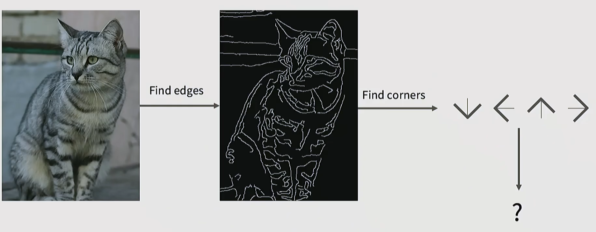

### 2.3 基于数据驱动的机器学习下的图像识别
#### 2.3.1  step1  收集图像数据集和具有标签的图像数据集
#### 2.3.2 step2  使用机器学习算法训练分类器
基于训练的数据，构建一个能够关联图像和标签的模型
#### 2.3.3 step3  使用分类器进行预测
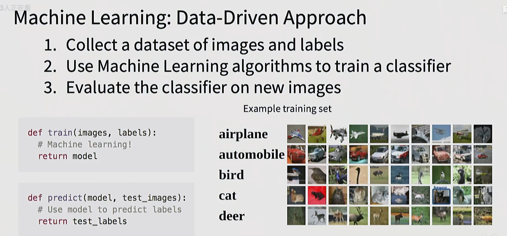

## 3 常见的分类模型
### 3.1 最近邻模型
显然 ，我们需要构建两个函数，一个是训练函数，一个是测试函数。
最终的目的是在测试函数中使用我们训练的模型能够准备识别出测试数据的标签。因此需要一个距离函数，这个距离函数能够计算两个向量的距离。
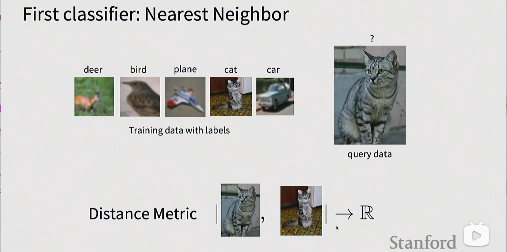
最简单的一种方式是L1距离，即两个向量的距离等于两个向量逐个相减，得到的新向量再依次相加。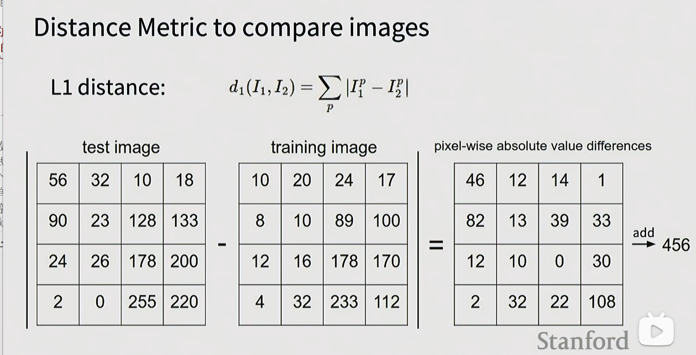

### 3.2 K近邻模型（K-Nearest Neighbor）
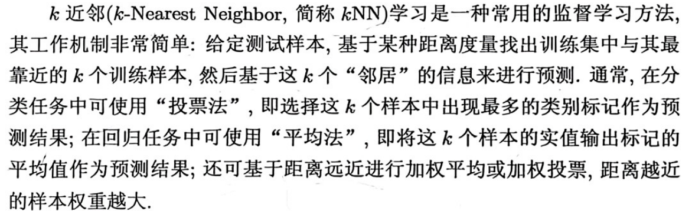

<!-- `来自西瓜书` -->
> 来自西瓜书

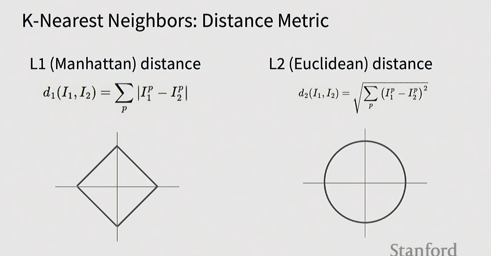

为什么要说 L1距离 和L2距离 上的点到边缘的距离都相等？ 对于一个圆 显然成立，但是需要解释的是，对于L1距离，只允许直线

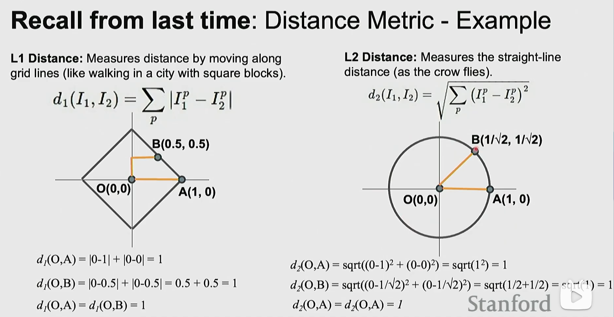

### 如何选择超参数
若是针对训练集，当K=1时，KNN 永远在训练集上表现良好，因为会记住所有的训练数据。
若是针对测试集，这显然是一个作弊的手段，因为相当于已知结果，根据结果进行训练，最后再用测试集作为输入，显然是作弊

因此，需要选择一个合适的K值，采用的方法是，将训练集分出一部分，先根据这个小部分进行训练，找到合适的K值，再根据这个K值进行训练（使用训练集中的其他部分），最后再使用测试集进行测试。

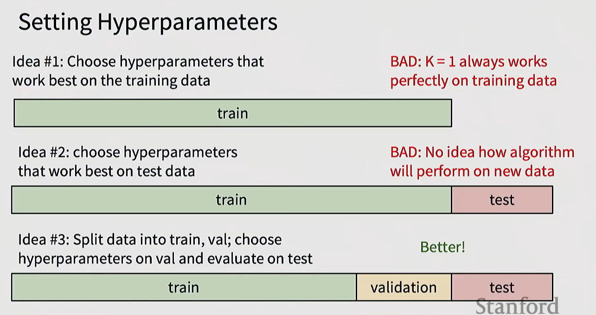

但是这种方法也存在问题，比如，你是没有办法确保你选取的一部分训练集（计划用来确定出最优的K值）能够准确代表整体的训练集，即可能出现分布不均的情况。

类似于，训练集中可能有90个红色苹果，10个蓝色苹果，但是你正好选择的小部分都是蓝色苹果，这显然不能代表整体的苹果分布。

因此，一种更好的方法，就是使用交叉验证。

**交叉验证法**(cross validation)先将数据集D划分为k个大小相似的互斥子集, 每个子集 D;都尽可能保持数据分布的一致性

即从D中通过分层采样得到，然后，每次用k-1个子集的并集作为训练集,余下的那个子集作为测试集;

这样就可获得k组训练/测试集,从而可进行k次训练和测试,最终返回的是这k个测试结果的均值.

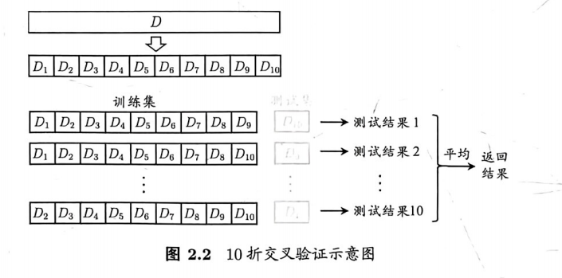

### softmax 回归

对于普通的逻辑回归，解决的是二分类问题，即只有两个类别，返回值是样本属于正例的概率，只能划分成 **正和非正**。

但现实情况是，我们通常需要解决多分类分类，即判断一个样本属于多个类别的概率。

如果基于逻辑回归，首先想到的 **拆解法**，是将多分类问题拆解为多个二分类问题，为拆分出的每个二分类问题都设置一个训练器，然后，将每个二分类问题的结果进行集成。

具体拆解方法是，将N个类别两两配对，组成N(N-1)/2 个二分类任务。如图所示，正负1代表了正例/反例，在三元ECOC码中，0代表不使用该样本。

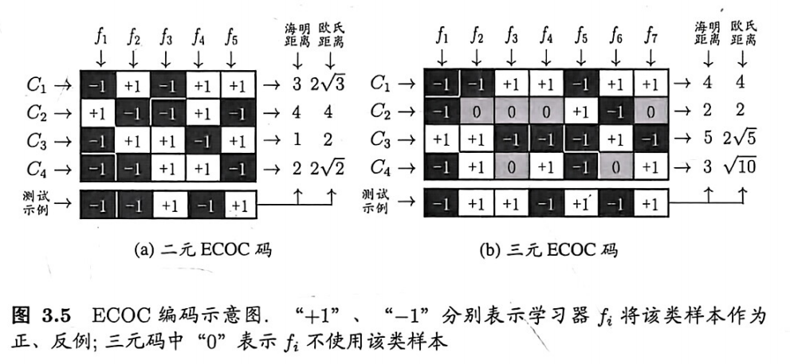

对于softmax回归，它的输出是多个值，表示样本属于各个类别的概率。
多分类的问题是几，就会输出几个值。
其输出一定会满足以下条件：
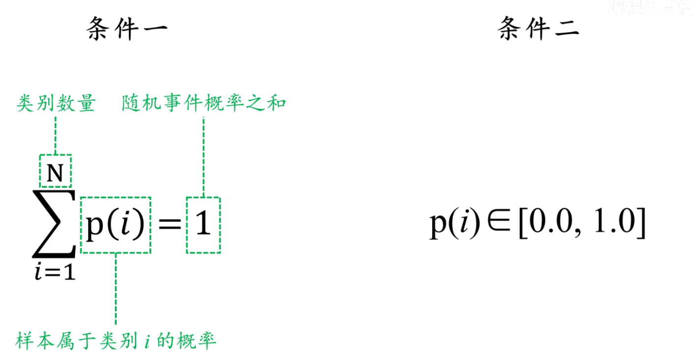

很好理解，第一，随机事件属于各个类别概率之和为1，第二，概率必须>=0,<=1

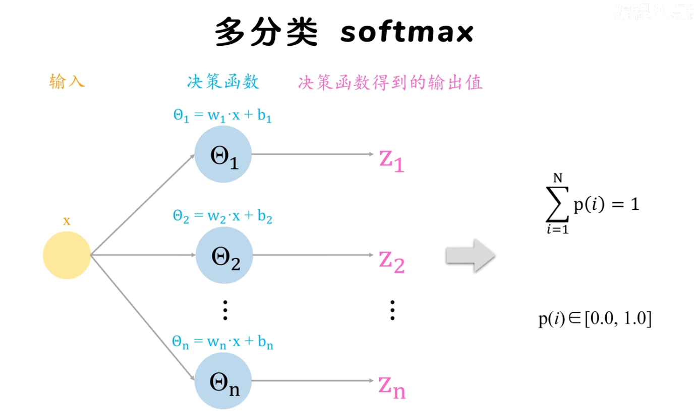
softmax函数用于将多个回归值映射到概率分布中，不管回归值是正负，通过指数化，softmax函数都会将值映射到0-1之间。

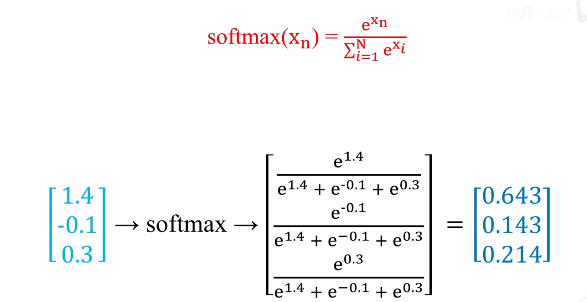

