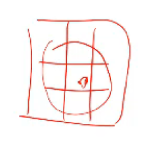
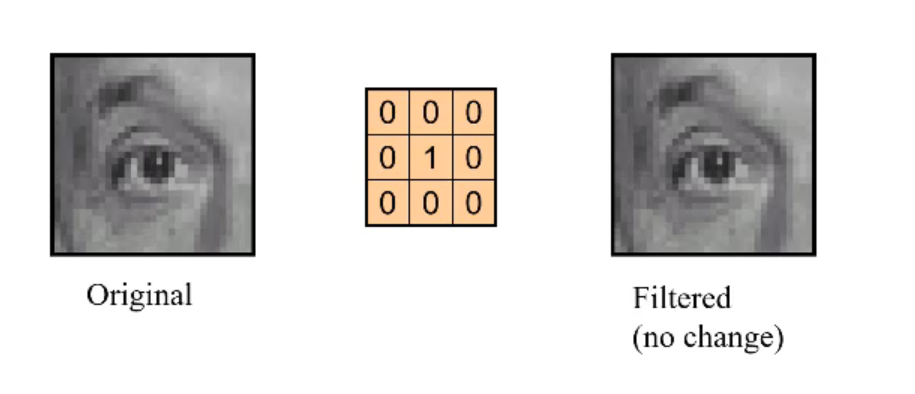
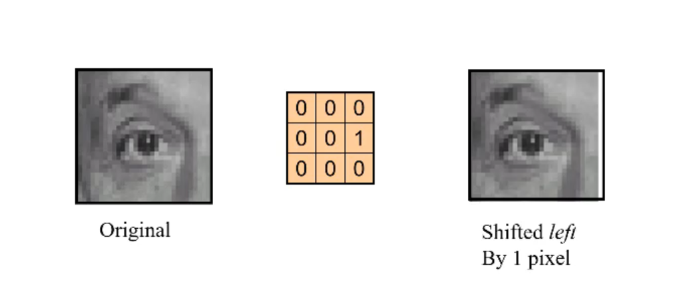
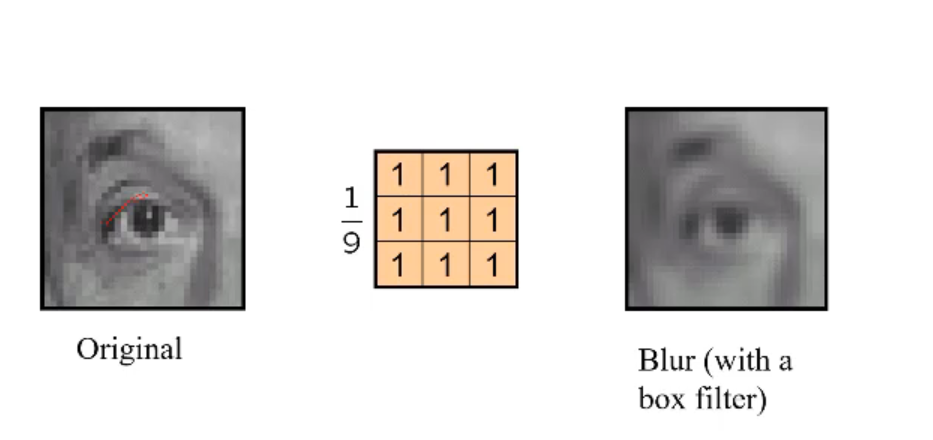
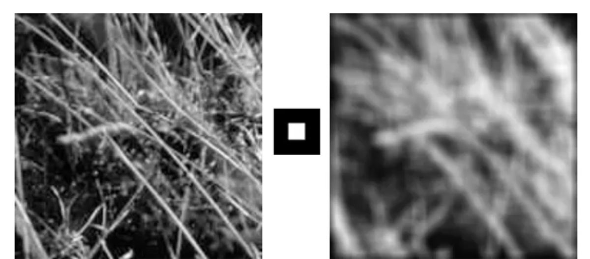
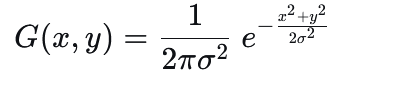

## 图像的分类
1.二进制图像   0-1

2.灰度图像   0-255

3.彩色图像   0-255 RGB

## 图像的去噪

1.均值滤波
这是一个简单的滤波方法，将图像的每个像素点替换为该像素点周围9个像素点的平均值

把加权平均的值叫做**滤波核（filter kernel）**
）** 或者**卷积核**

## 什么叫卷积
卷积是一种计算方式，将卷积核（filter kernel）和图像（image）进行卷积，卷积核和图像的像素点进行乘法运算，然后求和，得到卷积结果。

## 卷积操作的特性

1. 线性
对于f1和f2两个图像 ，先求和再卷积 和先求和再卷积 结果相同
> filter(f1+f2)=filter(f1)+filter(f2)
2. 平移不变性
> filter(shift(f))=shift(filter(f))
3. 交换律 结合律 分配律 实数结合 可放任意位置 

4. 和脉冲信号相乘 还是脉冲信号

举例：

使用以下滤波器，还是原图

相当于左移一个像素

边缘信号 会更加平滑 相当于把尖锐的像素平均了

## 高斯滤波

振零效应 ：振铃”这个名字非常形象，它来源于物理学中敲击钟后产生的余波振荡。

    你只敲了一下（一个脉冲），但钟会因为其固有特性而“嗡——”地响一阵子（衰减振荡）。

    在图像处理中，一个尖锐的边缘（就像那个敲击的脉冲）经过某些系统处理后，其响应的“余波”就会在边缘两侧扩散开来，形成明暗条纹，这就是视觉上的“振铃”。

为了缓解振零效应，使用高斯函数进行权值赋值

把每个点的坐标代入高斯函数， 

> x 和 y 分别是像素点的坐标。σ: 标准差。这是最关键的参数，它决定了曲线的“宽度”或“扩散程度”。

> σ 越大，曲线越扁平、越宽，中间的值被影响的越大；

> σ 越小，数据越集中，曲线越尖锐、越窄，中间值占的比重越大，被影响的越小，滤波效果越小。

得到离散的权重，但是要整个模版的权值加起来为1，（因为若是相加不为1，则会在一定程度上削弱图像，或者增强图像）所以一定要进行归一化

