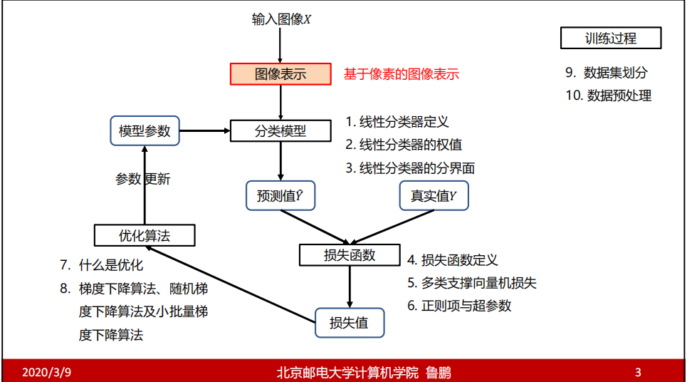
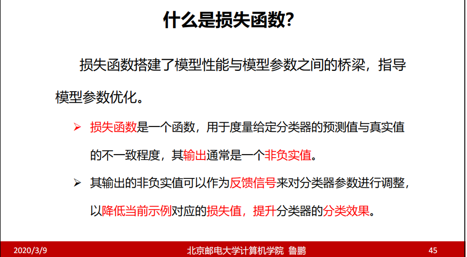
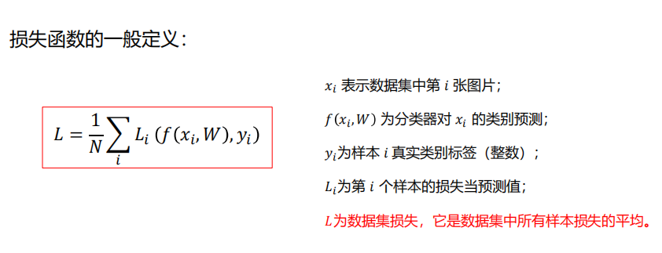
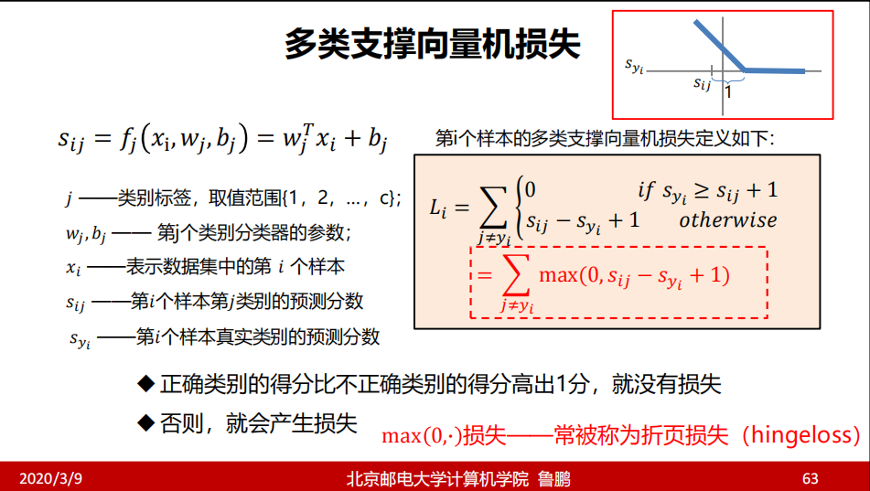
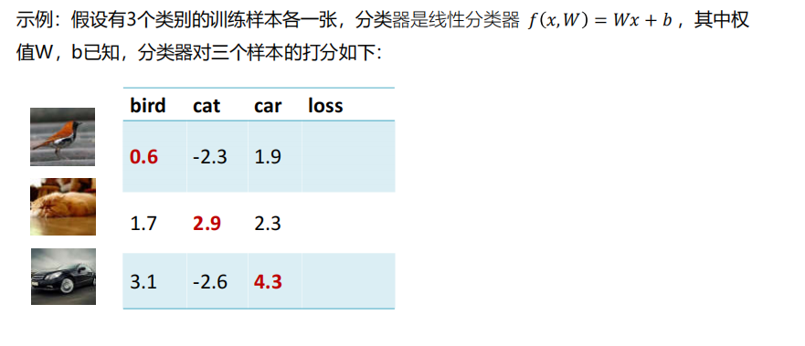
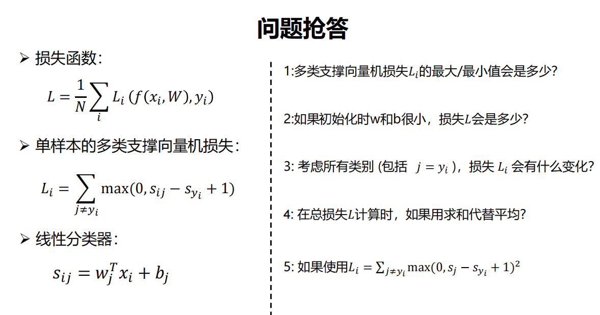
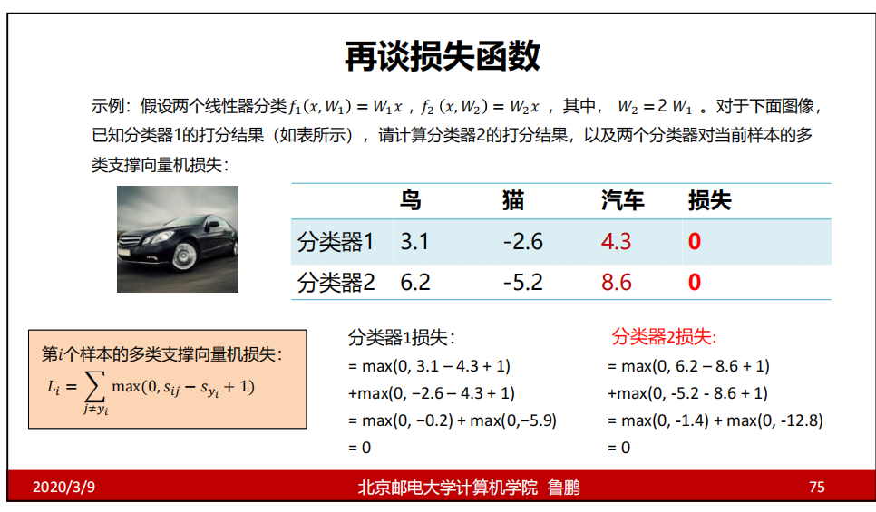
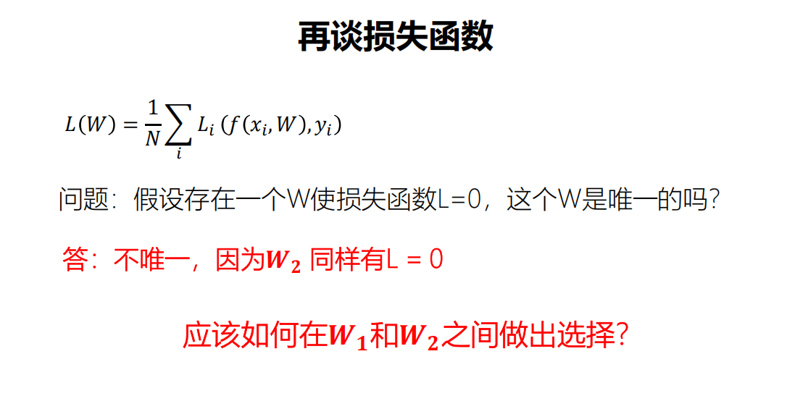

> 前言:
整个课程的框架：

## 4. 损失函数

W 就包含了 y=wx+b 中的 W

## 5. 多类支撑向量机损失

意思就是 当【该样本的真实类别的分数】都大于等于【其他类别的预测分数+1】时，说明此时样本属于该类，判断正确。此时便没有损失。

否则就要计算出损失，损失等于 【其他类别的预测分数】-【该样本的真实类别的分数】（肯定是一个大于0的数，因为一旦进入该类，代表把当前的狗类判断成了其他类，所以肯定有分类器大于真实分类的分数）+1

> 至于为什么要+1呢？ 是因为会有噪声等干扰。

手算 loss 分别为：
对于鸟的损失：
 0.6>-2.3 无损，0.6<1.9 有损失 为 1.9-0.6 +1 = 2.3
 对于猫的损失：
 max(0, 1.7-2.9+1) +max(0,2.3-2.9+1) = 0+0.4 = 0.4

 

 1. min =0 max =无穷
 2. 

为了能够正确的作出W的选择，需要修改原来的损失函数。

什么是超参数？